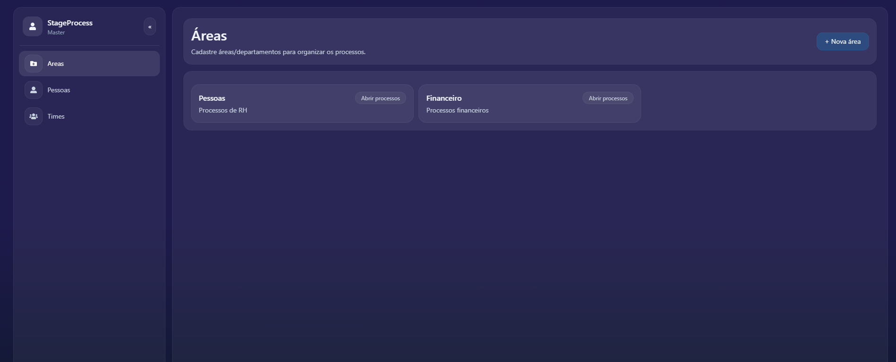
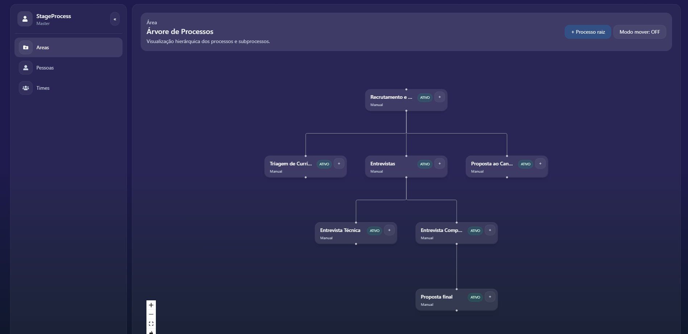
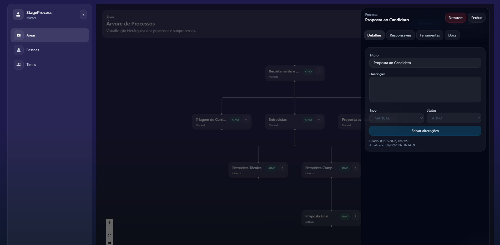
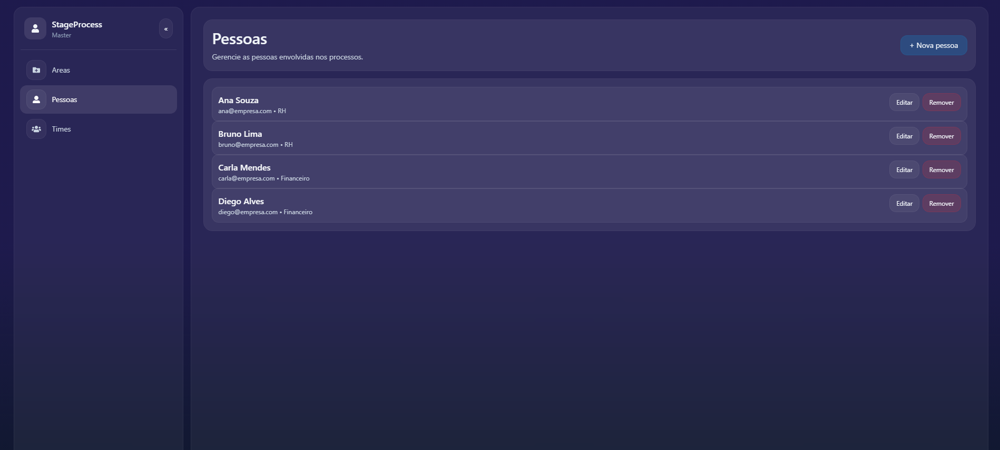

# 📌 Stage Process - Gestão de processos

Este projeto é uma aplicação **fullstack** desenvolvida como solução para um **case técnico**, cujo objetivo é permitir a **gestão visual e hierárquica de processos empresariais**, organizados por áreas, com foco em usabilidade, regras de negócio claras e boa arquitetura.

A aplicação permite criar, visualizar, mover, editar e organizar processos em forma de **árvore**, além de gerenciar responsáveis, documentos e ferramentas associadas a cada processo.

---

## Visão Geral da Solução

### Principais funcionalidades
- Gestão de **Áreas**
- Criação de **processos raiz** e **subprocessos**
- Visualização da árvore de processos com **React Flow**
- **Auto-layout** da árvore (top-down) usando **Dagre**
- **Mover processos via drag-and-drop**, com regras de negócio:
  - mudar de pai
  - reordenar posição entre irmãos
  - tornar processo raiz
  - impedir ciclos (não pode virar filho de si mesmo ou de descendentes)
- Atualização de **status**, com:
  - atualização em cascata quando o processo é raiz
- Associação de:
  - **Responsáveis (people)**
  - **Documentos**
  - **Ferramentas**
- Remoção de processos (regra: **não pode remover se possuir subprocessos**)
- Interface moderna, responsiva e focada em UX

---

## Stack Tecnológica

### Backend
- **Node.js**
- **NestJS**
- **Prisma ORM**
- **PostgreSQL**
- **Docker / Docker Compose**
- **Swagger (OpenAPI)** para documentação da API

### Frontend
- **React + Vite**
- **TypeScript**
- **TailwindCSS**
- **React Query**
- **React Flow (@xyflow/react)**
- **Dagre** (auto-layout)
- **React Hot Toast**

---

## Arquitetura


```text
frontend/
  ├─ pages/
  ├─ components/
  │   ├─ nodes/
  │   ├─ drawers/
  │   ├─ modals/
  ├─ hooks/
  ├─ utils/
  └─ api/

backend/
  ├─ modules/
  │   ├─ areas/
  │   ├─ processes/
  │   ├─ people/
  │   ├─ teams/
  ├─ prisma/
  ├─ infra/
  └─ schemas/
```
---
## Documentação da API

A documentação Swagger das rotas da API estará disponível no link **http://localhost:3000/docs** após a execução do servidor Nest.

---
## Screenshots





---
## Como executar esse projeto localmente

- Instanciar banco de dados: **docker compose up -d db**
- Executar migrations e seed: **docker compose run --rm migrator**
- Iniciar front e back: **docker compose up -d backend frontend**
- Acessar a página web: **http://localhost:5173**
- Logar com usuário padrão: **Usuário: master / Senha: 123456**